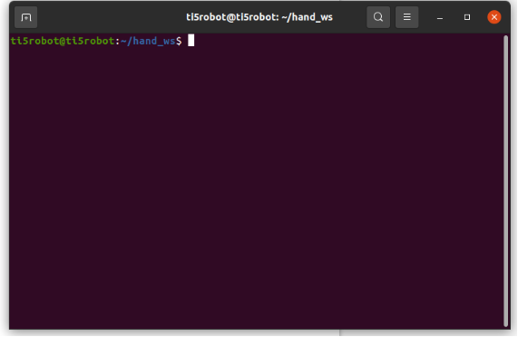
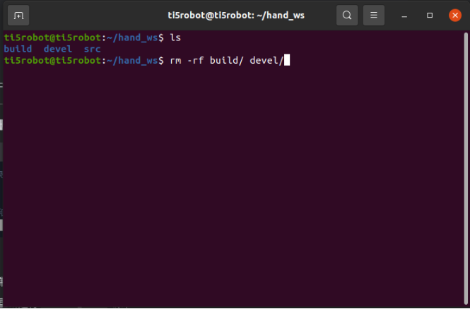
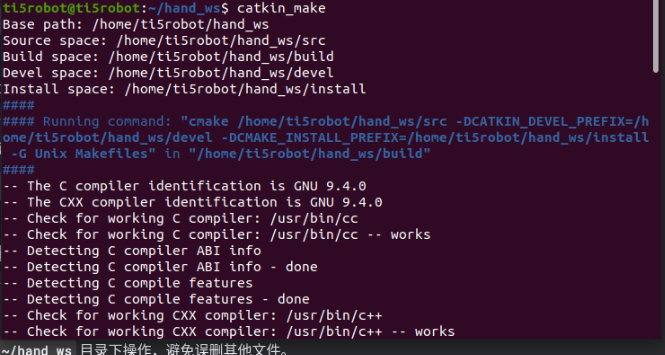
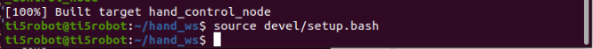
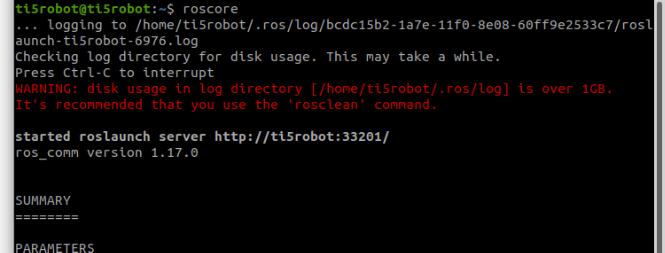
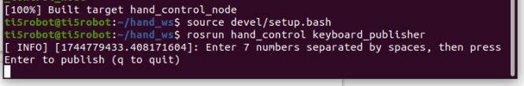
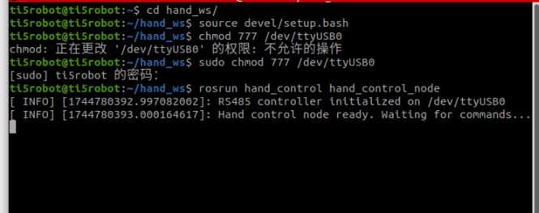
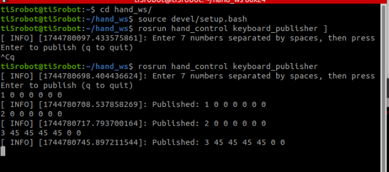

首先cd 进入~/hand\_ws

然后删除 build/ devel/文件夹

### 删除后重新编译

cd ~/hand\_ws

catkin\_make

source devel/setup.bash

新打开一个终端，输入roscore命令运行ros1主节点 

在一开始的终端运行键盘发布节点

source devel/setup.bash

rosrun hand\_control keyboard\_publisher

新开一个终端，将机械手通电并且usb插上设备

输入命令

cd ~/hand\_ws

source devel/setup.bash

给予设备权限 sudo chmod 777 /dev/ttyUSB0

rosrun hand\_control hand\_control\_node 

最后就可以在键盘输入的节点，发布命令

比如1 0 0 0 0 0 0为握紧手 当第一个数字为1时6个数字无意义，任意填

`    `2 0 0 0 0 0 0为松开手 当第一个数字为2时6个数字无意义，任意填

`    `3 45 45 45 45 0 0 当第一个数字为三是给手6个关节任意角度

比如3 0 0 0 0 0 0 相当于松开手

